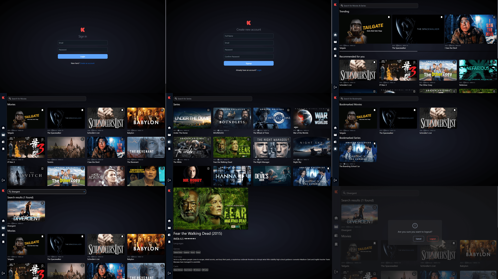
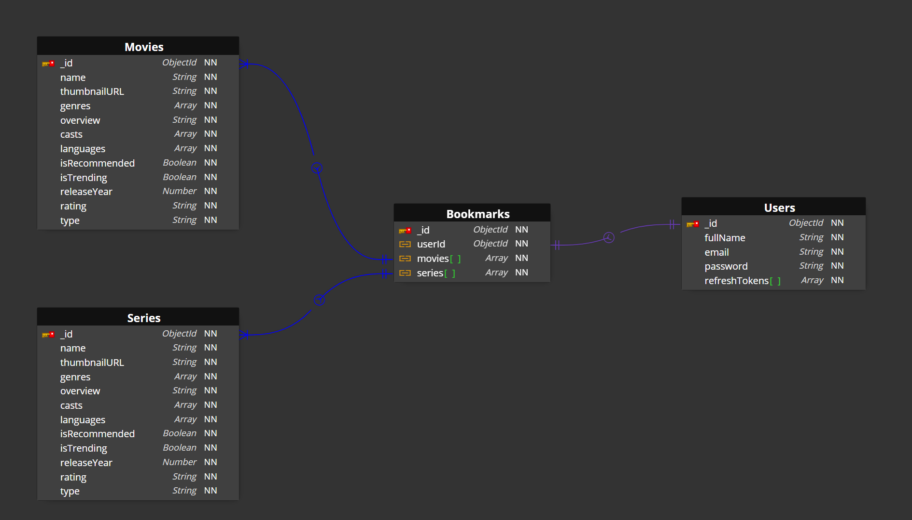

# Flixy - Explore movies and series


## Deployment URL

- **Front-End: <frontend-url>**
- **Back-End: <backend-url>**

## Overview

Flixy is a simple app designed to help you discover, bookmark, and search for your favorite movies and series. Its user-friendly interface allows easy navigation, and the practical search feature ensures you can quickly find and bookmark content. Built with simplicity in mind, Flixy offers a straightforward experience for exploring and managing your entertainment preferences. Your bookmarks and preferences are securely stored, making Flixy an uncomplicated and reliable choice for your movie and series enjoyment.



### Features

- **Responsive UI**

  - Clean and responsive design for a seamless user experience.

- **Authentication**

  - Secure authentication system utilizing JWT access and refresh tokens, while safeguarding against XSS attacks through in-memory access-token storage.

- **Movies and Series Exploration**

  - Hassle-free exploration of a vast collection of movies and series.

- **Searching Functionality**

  - Convenient search bar for quick and easy content discovery.

- **Bookmark Functionality**

  - Users can add movies/series to bookmarks, securely stored in the database.

- **Proper Error Handling and Logging**
  - Comprehensive error handling for graceful recovery and detailed logging for efficient debugging and maintenance.

---

## Technologies Used

### Front-end

- **React.js:** Utilized React.js for building a dynamic and interactive user interface.

- **Tailwind CSS:** Employed Tailwind CSS for efficient and responsive designs.

- **Redux Toolkit:** Implemented Redux Toolkit for robust state management, ensuring a scalable and maintainable application structure.

- **RTK Query:** Leveraged RTK Query for streamlined and efficient data fetching.

### Back-end

- **Express.js:** Employed Express.js to create a robust and scalable RESTful API.

- **MongoDB:** Utilized MongoDB as the database to store and retrieve data, ensuring persistent and reliable data storage for the application.

---

## How to Run

1. **Clone the Repository:**

   ```bash
   git clone <githubrepo-url>
   ```

2. **Install the dependencies:**

   ```bash
   # Install the dependencies of React App
   cd client && npm i
   # Install the dependencies of express API and insert the movies and series data into database
   cd server && npm i && npm run load-data
   ```

3. **Running the Project Locally:** Navigate to the project's root directory and run the following commands

   ```bash
   # Run the express server
   npm run server

   # Run the react server
   npm run client
   ```

   **OR**

   ```bash
   # Run both servers concurrently
   npm run both
   ```

**Upon Completion**

> The React development server will be accessible at http://localhost:3000.

> The Express server will be accessible at http://localhost:8000.

---

## Database Entity Relationship (ER) Diagram



## License

This repository is MIT licensed. [Read more](./LICENSE)

---
